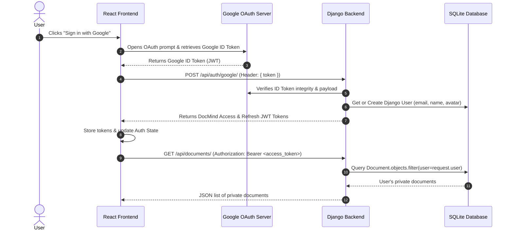

# DocMind — Authentication & User Data Isolation Plan

## 📌 Context & Overview
Currently, **DocMind** functions as a single-tenant workspace. Uploaded documents, extracted text summaries, and chat session histories are stored in SQLite without user ownership constraints. Any user accessing the frontend can view, query, and delete documents uploaded by any other user.

This plan details the implementation of **Google OAuth 2.0 Single Sign-On (SSO)**, **JWT-based session management**, **Django REST Framework API data scoping**, and **Frontend Auth state management** to ensure users can **only view, chat with, and manage their own documents**.

---

## 🎯 Core Objectives
1. **Google OAuth 2.0 Integration**: Enable effortless sign-in using Google accounts via `@react-oauth/google` and Google ID token verification.
2. **User Data Ownership**: Assign explicit ownership (`User` foreign key) to all `Document` and `ChatSession` records.
3. **Strict Queryset Scoping**: Enforce backend permission checks (`IsAuthenticated`) and filter querysets (`request.user`) across all API endpoints.
4. **Protected Document Media**: Ensure PDF/DOCX file access requires authenticated ownership validation.
5. **Seamless Frontend Auth UX**: Manage authentication state via React Context, persist JWT tokens, attach `Authorization` headers dynamically, and provide automatic token error handling.

---

## 🏗️ Authentication & Scoping Flow Diagram

---

## 📂 Implementation Roadmap

### 🔹 Phase 1: Database Models & User Ownership (Backend)
- Add `user = models.ForeignKey(User, on_delete=models.CASCADE, related_name='...')` to:
  - `Document` model in `backend/documents/models.py`
  - `ChatSession` model in `backend/chat/models.py`
- Run Django migrations to update SQLite database structure.
- Clean up or migrate legacy dev records without assigned users.

### 🔹 Phase 2: Google Authentication & JWT Endpoints (Backend)
- Install `djangorestframework-simplejwt` and `google-auth`.
- Update `backend/docmind_backend/settings.py`:
  - Register `rest_framework_simplejwt`.
  - Set `REST_FRAMEWORK` default authentication to `JWTAuthentication`.
- Create Auth App or Endpoint (`/api/auth/google/`):
  - Receive Google ID token from frontend.
  - Verify token via Google API client.
  - Extract email, first name, last name, and profile picture.
  - Create or retrieve Django `User`.
  - Issue DocMind JWT `access` and `refresh` tokens.

### 🔹 Phase 3: Data Scoping & API Security (Backend)
- Update `DocumentViewSet` (`backend/documents/views.py`):
  - Add `permission_classes = [IsAuthenticated]`.
  - Override `get_queryset()` to return `Document.objects.filter(user=self.request.user)`.
  - Auto-assign `user=self.request.user` on document upload.
- Update `ChatSessionViewSet` (`backend/chat/views.py`):
  - Add `permission_classes = [IsAuthenticated]`.
  - Override `get_queryset()` to return `ChatSession.objects.filter(user=self.request.user)`.
  - Auto-assign `user=self.request.user` on session creation.
- Add protected document download/view endpoint to restrict file serving to owners.

### 🔹 Phase 4: Frontend Auth State, Google Login & Axios Interceptors
- Install `@react-oauth/google` in `frontend/`.
- Wrap application with `<GoogleOAuthProvider>`.
- Create `AuthContext.jsx`:
  - Manage `user`, `accessToken`, `refreshToken`, `isAuthenticated`, `login()`, `logout()`.
  - Persist session in `localStorage`.
- Update `api.js` Axios instance:
  - Add Request Interceptor to auto-inject `Authorization: Bearer <access_token>`.
  - Add Response Interceptor to handle `401 Unauthorized` (token refresh / logout redirect).
- Build Login UI & Header User Profile:
  - Sleek modal or screen with Google Login button when unauthenticated.
  - User avatar, name, and Logout button in `Sidebar.jsx`.

### 🔹 Phase 5: Verification & End-to-End Testing
- Test Google SSO login flow.
- Test user isolation with two distinct Google accounts:
  - Upload document with User A -> Verify User B cannot see or query User A's document.
  - Upload document with User B -> Verify User A cannot see or query User B's document.
- Verify token expiration and logout security.

---

## 🔒 Security Matrix

| Feature | Unauthenticated User | Authenticated User A | Authenticated User B |
| :--- | :--- | :--- | :--- |
| **App Access** | Redirected to Login Screen | Full Workspace Access | Full Workspace Access |
| **Documents API** | `401 Unauthorized` | Sees only User A documents | Sees only User B documents |
| **Chat Sessions API**| `401 Unauthorized` | Sees only User A chats | Sees only User B chats |
| **Document Files** | Access Denied | Can view/download User A files | Can view/download User B files |
