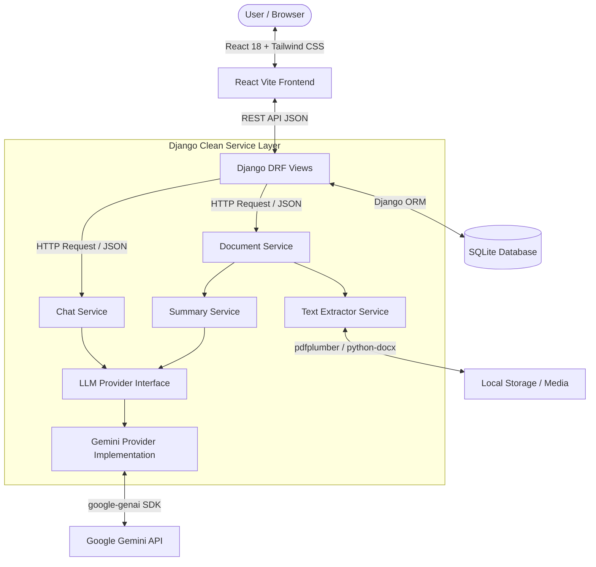

# DocMind — AI Document Assistant (Specification & Blueprint)

## 📌 Project Overview
**DocMind** is a modern, production-grade AI Document Assistant built with **React**, **Tailwind CSS**, and **Django REST Framework (DRF)**. Designed as a **Minimal AI Workspace** (inspired by Notion, Linear, ChatGPT, and Claude), it enables users to upload documents (PDF, DOCX, TXT), view them side-by-side with an AI chat interface, inspect automated executive summaries, and ask document-grounded questions with rich Markdown rendering.

---

## 🎯 Strategic Goals & Architecture Principles

### 1. Minimal AI Workspace Design Aesthetic
- **Utility-First Styling:** Built with **Tailwind CSS v3** for clean responsiveness, high performance, and simple dark mode maintenance.
- **Clean UI Philosophy:** Minimalist canvas (`bg-zinc-950`), crisp micro-borders (`border-zinc-800`), sleek typography, and high-contrast readable chat layouts.

### 2. Full-Text Context Injection (No V1 RAG Overkill)
- Leverages the **1,000,000+ token context window** of Google Gemini 1.5 / 2.0 Flash to fit 50–100 page documents directly into prompt context.
- Eliminates vector DB overhead, embedding infrastructure, and API costs in V1.

### 3. Decoupled Provider Pattern & Service Layer
- **No Third-Party SDKs in Views:** Views strictly handle HTTP request validation and JSON response serialization.
- **Service Layer Abstraction:** Business logic is encapsulated in isolated services (`extractor.py`, `summary.py`, `chat_service.py`).
- **Provider Pattern for LLM:** AI calls go through an abstract `LLMProvider` interface (`base.py`). Swapping Gemini for OpenAI, Claude, or local Ollama requires zero view-level changes.

### 4. Rich Native Rendering
- AI responses rendered with `react-markdown` + `remark-gfm` to natively support headings, bullet lists, bold text, quotes, and code blocks.

---

## 🏗️ Architecture Diagram



---

## 🛠️ Finalized Tech Stack

### 🎨 Frontend (Client Side)
- **Framework:** React 18 (Vite)
- **Styling:** Tailwind CSS v3 (Minimal AI Workspace & Dark Theme)
- **Icons:** `lucide-react`
- **Markdown Renderer:** `react-markdown` + `remark-gfm`
- **Document Preview:** PDF.js / `react-pdf`
- **HTTP Client:** `axios`

### ⚙️ Backend (Server Side)
- **Language:** Python 3.12
- **Framework:** Django 5.x
- **API Engine:** Django REST Framework (DRF)
- **CORS:** `django-cors-headers`

### 🧠 AI & File Processing Engine
- **LLM Abstraction:** Custom `LLMProvider` interface (`ai/services/base.py`)
- **Primary AI Provider:** `GeminiService` via `google-genai` Python SDK (`ai/services/gemini.py`)
- **PDF Processing:** `pdfplumber` / `pypdf`
- **Word Processing:** `python-docx`

### 💾 Database & Storage
- **Database:** SQLite (`db.sqlite3`) via Django ORM
- **File Storage:** Local Disk (`media/documents/`)

---

## 📂 Implementation Roadmap & Phase Progress

### ✅ Phase 1: Project Foundation (Completed)
- [x] Initialized Python virtual environment (`venv/`) and installed dependencies (`django`, `djangorestframework`, `django-cors-headers`, `google-genai`, `pdfplumber`, `python-docx`, `pypdf`).
- [x] Created React 18 + Vite frontend with Tailwind CSS (`frontend/`).
- [x] Installed frontend UI packages (`lucide-react`, `axios`, `react-markdown`, `remark-gfm`, `pdfjs-dist`).
- [x] Created Django project `backend/` and Django apps (`ai`, `documents`, `chat`).
- [x] Implemented service layer directories (`ai/services/`, `documents/services/`, `chat/services/`).
- [x] Authored abstract `LLMProvider` interface (`base.py`) and `GeminiService` placeholder.
- [x] Authored service placeholders for `DocumentExtractor`, `DocumentSummaryService`, and `ChatOrchestratorService`.
- [x] Configured CORS middleware, allowed origins (`http://localhost:5173`), and Django media settings (`settings.py`, `urls.py`).
- [x] Built React component shells (`Sidebar.jsx`, `DocumentViewer.jsx`, `ChatPanel.jsx`, `api.js`).
- [x] Verified zero Django issues and clean Vite production build.

### ⏳ Phase 2: Database Models & Data Flow
- [ ] Define `Document` model (title, file, mime_type, extracted_text, executive_summary, suggested_questions, created_at).
- [ ] Define `ChatSession` & `ChatMessage` models (session title, document FK, role, content, created_at).
- [ ] Build DRF Serializers & API Viewsets for upload, document retrieval, and message listing.

### ⏳ Phase 3: Text Extraction & Gemini Integration
- [ ] Implement `DocumentExtractor` logic for PDF, DOCX, and TXT parsing.
- [ ] Implement `GeminiService` for prompt execution and automated executive summary generation.
- [ ] Connect upload view to auto-trigger extraction and summary services.

### ⏳ Phase 4: Interactive Dual-Pane UI & Chat Streaming
- [ ] Connect React `DocumentViewer` to PDF previewer and file uploader.
- [ ] Connect React `ChatPanel` with `react-markdown` to DRF chat API endpoints.
- [ ] Implement quick dynamic action prompt buttons ("Summarize", "Key Takeaways", "Quiz").

### ⏳ Phase 5: End-to-End Verification & Polish
- [ ] Perform end-to-end upload & chat testing.
- [ ] Polish error states, loading skeletons, and minimal dark workspace styling.

---

## 📂 Active Workspace File Tree

```text
Chatbot project/
├── venv/                      # Isolated Python Virtual Environment
├── DOCMIND_SPECIFICATION.md   # Architectural & Blueprint Specification
├── backend/                   # Django REST Framework Backend
│   ├── db.sqlite3             # SQLite Database File
│   ├── manage.py
│   ├── docmind_backend/       # Global Settings, Master URLs, WSGI
│   │   ├── settings.py        # Configured for DRF, CORS, Media & Apps
│   │   └── urls.py            # Master API Router & Media serving
│   ├── ai/                    # LLM Provider Abstraction Module
│   │   └── services/
│   │       ├── base.py        # Abstract LLMProvider Base Class
│   │       └── gemini.py      # Concrete Gemini Service Placeholder
│   ├── documents/             # Document Management Module
│   │   ├── models.py / views.py / serializers.py
│   │   └── services/
│   │       ├── extractor.py   # DocumentExtractor Service Placeholder
│   │       └── summary.py     # DocumentSummaryService Placeholder
│   ├── chat/                  # Conversational Engine Module
│   │   ├── models.py / views.py / serializers.py
│   │   └── services/
│   │       └── chat_service.py # ChatOrchestratorService Placeholder
│   └── media/                 # Local Media Folder for User Uploads
└── frontend/                  # React 18 + Vite Frontend
    ├── package.json
    ├── vite.config.js          # Configured with @tailwindcss/vite
    └── src/
        ├── index.css          # Minimal AI Workspace Dark Theme Base
        ├── App.jsx            # Split-Screen Workspace Shell
        ├── services/
        │   └── api.js         # Pre-configured Axios API Client
        └── components/
            ├── Sidebar.jsx        # Document Workspace Navigation
            ├── DocumentViewer.jsx # Dual-Pane Document Viewer Shell
            └── ChatPanel.jsx      # Minimal AI Chat UI Shell
```
